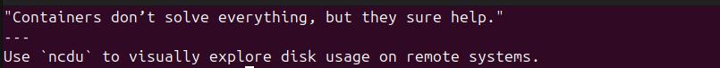
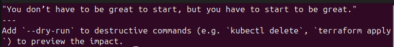
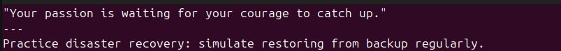

# Devops Inspirational Terminal

This bash script customizes the terminal to display DevOps and Inspirational tips to reinforce learning and keep going. Currently, there are about 250 tips and 2 would be randomly displayed on each launch of the terminal. More tips would be added in due course.

## Overview

## Instruction

To install this on your terminal, run the following commands.

`git clone https://github.com/frankfolabi/learn-bash.git` 

Move to the inspire terminal directory

`cd learn-bash/inspire-terminal`

Execute the script

`bash setup.sh`

You can now enjoy your terminal with DevOps tips and quotes.
---
